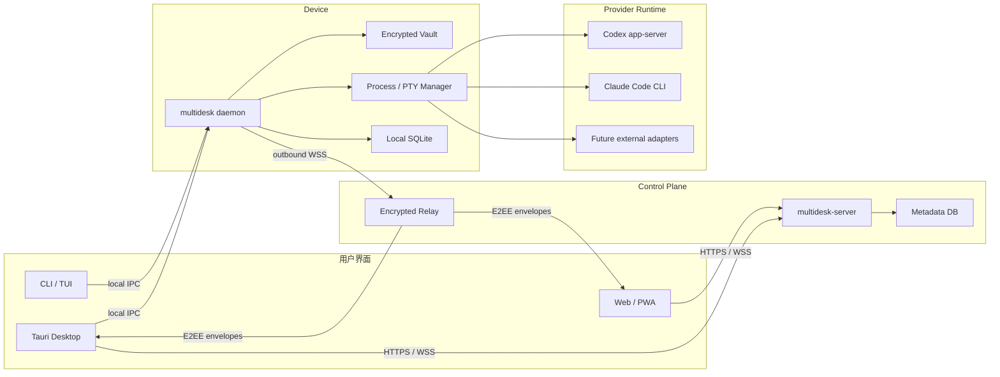

# MultiAgentDesk v0.1 详细产品与实施计划

> 状态：Reviewed implementation baseline
> 文档版本：0.2
> 基线日期：2026-07-10
> 目标仓库：`jinlong17/multi-agent-desk`
> 许可证：Apache-2.0
> 独立审查：`docs/reviews/2026-07-10-fable5-high-plan-review.md`

## 1. 执行摘要

MultiAgentDesk 是一个本地优先、跨设备、自托管优先的 AI Coding Agent 工作区。它统一管理 Codex、Claude Code 以及后续 Provider 的账号、运行 Profile、设备、工作区、会话、用量和远程交互，但不提供自动轮换账号、额度规避、代理重放或浏览器 Cookie 抓取能力。

v0.1 采用以下已经锁定的技术方案：

- Go 实现 CLI、TUI、Device Daemon、Control Plane 和 Provider 核心。
- React + TypeScript + Vite 实现 Web/PWA。
- Tauri 2 复用 Web UI，并将 Go Device Daemon 打包为桌面 Sidecar。
- SQLite WAL 同时用于设备端和 v0.1 单用户 Control Plane。
- REST/OpenAPI 承载普通 CRUD；WebSocket 承载状态、审批和终端流。
- Codex 通过官方 `codex app-server` 做结构化集成。
- Claude Code 通过官方 CLI、PTY、Hooks 和 `claude auth status` 集成。
- Provider 凭据只存在于用户设备的本地 Vault；Control Plane 不保存明文凭据。
- 普通配置自动同步；凭据只在用户明确授权时通过端到端加密传输。
- 账号选择采用“系统推荐、用户确认”，会话中禁止透明切换。
- Web、Desktop 和 Daemon 都是具有独立签名/交换密钥的设备；Passkey 登录不等于 E2EE 身份。
- v0.1 对外只稳定内置 Provider 接口；AgentDefinition 和公共 Adapter SDK 延后到 v0.2。

## 2. 产品目标与边界

### 2.1 目标用户

v0.1 面向单个开发者，典型环境为：

- 一台主要 Mac。
- 一台或多台 Windows 设备。
- 多台通过 SSH 使用的 Linux 开发服务器。
- 多个 Codex 或 Claude Code 账号/Profile。
- 希望在浏览器或桌面端查看并接管服务器任务。

### 2.2 核心任务

用户必须能够：

1. 在本地设备添加多个 Codex 和 Claude Code 账号。
2. 为每个账号建立独立、可识别、不会互相污染的 Runtime Profile。
3. 将指定账号明确授权给指定远程服务器，而不是重新逐个登录。
4. 在远程服务器 CLI/TUI 中查看账号状态、用量和健康度。
5. 选择或确认推荐账号后启动 Codex/Claude Code 任务。
6. 从 Web 或桌面端查看运行状态、进入终端、发送输入和处理审批。
7. 撤销设备、账号授权或单个 CredentialInstance。
8. 在 Control Plane 离线时继续使用本地 CLI 和已存在的本地授权。

### 2.3 非目标

以下内容明确不进入 v0.1：

- 自动轮换账号以绕过 Provider 限制。
- 会话运行中无感切换账号。
- 将多个订阅账号聚合成代理池。
- 拦截、修改、重放或代理 Provider API 请求。
- 抓取浏览器 Cookie、网页 Session 或未知内部接口。
- 替第三方用户提供 Claude.ai 或 ChatGPT 登录代理。
- 团队、多租户、RBAC、组织计费和托管 SaaS。
- 手机原生客户端；v0.1 使用响应式 Web/PWA。
- 云端存储完整终端正文和 Provider 会话正文。

## 3. 产品形态

| 形态 | v0.1 平台 | 核心职责 |
|---|---|---|
| CLI/TUI | macOS、Windows、Linux | 服务器核心入口；账号、用量、任务、附着、配对 |
| Device Daemon | macOS、Windows、Linux | Vault、Provider 进程、会话、设备连接和本地事实源 |
| Web/PWA | 现代桌面浏览器；移动端 best-effort | 统一看板、远程任务、审批、终端和设备管理 |
| Desktop | macOS 稳定版；Windows Experimental 预览 | Web UI + 本机 Daemon Sidecar + 托盘 + Deep Link |
| Control Plane | Linux Docker | 身份、设备目录、非秘密配置、元数据、加密消息路由 |

统一命名：

- 产品显示名：`MultiAgentDesk`
- 仓库名：`multi-agent-desk`
- CLI/Daemon 二进制：`multidesk`
- Control Plane 二进制：`multidesk-server`
- Deep Link：`multiagentdesk://`
- 默认配置目录：`~/.config/multidesk`（Windows 使用系统 AppData）
- 默认数据目录：遵循各平台应用数据目录，不硬编码到 Home 根目录

## 4. 系统架构



### 4.1 架构原则

1. Device Daemon 是账号凭据、Provider 进程和完整会话内容的所有者。
2. Control Plane 是设备目录、同步元数据和消息路由服务，不是凭据代理；其公钥目录只是索引，不是信任锚。
3. 所有远程 Device Daemon 只建立出站连接，不监听公网端口。
4. Web 与 Desktop 使用同一套 React 页面、协议类型和权限语义。
5. Provider 差异通过 Capability 声明，不以最低共同能力强行抽象。
6. 内置 Provider 与外部 Provider 使用相同领域模型，但外部 Adapter 运行在独立进程。
7. 本地功能不依赖 Control Plane 在线；远程交互才依赖 Control Plane。
8. 每个设备本地维护已人工核对的 Pinned Key Directory；密钥变化必须重新配对。
9. Session 进程生命周期与客户端 Attachment/ControllerLease 分离。

### 4.2 信任边界

| 边界 | 信任假设 | 必须防御 |
|---|---|---|
| 用户 ↔ Web | 用户已通过 Passkey 登录，Web Device 已单独批准 | Session 劫持、XSS、CSRF、未批准客户端解密 |
| Web ↔ Control Plane | TLS 正常、服务端可能被读取 | 明文凭据/终端泄漏 |
| Control Plane ↔ Device | 设备身份已配对且公钥已在本地 pin | 换钥中间人、伪造设备、重放、消息篡改 |
| Daemon ↔ Provider | Provider 二进制由用户安装或受信发布 | 参数注入、配置串号、秘密泄漏 |
| Daemon ↔ 本地磁盘 | 主机可能被普通用户进程读取 | 文件权限错误、崩溃残留 |
| 已授权服务器 | 服务器在授权期内可使用凭据 | 不可虚假承诺远程擦除已复制秘密 |

## 5. 组件职责

### 5.1 `multidesk` CLI/TUI

一个 Go 二进制同时承载前台 CLI/TUI 和后台 Daemon 子命令，降低服务器安装复杂度。

```text
multidesk init
multidesk daemon install|uninstall|start|stop|status|serve
multidesk login codex|claude
multidesk accounts list|show|disable
multidesk profiles list|create|edit|delete|validate
multidesk usage [--provider] [--account]
multidesk devices list|pair|revoke
multidesk credentials grant|revoke|status
multidesk vault status|unlock|lock
multidesk run <provider> [--profile] [--workspace]
multidesk sessions list|show|stop|kill|resume
multidesk attach <session-id>
multidesk control acquire|release <session-id>
multidesk tui
```

规则：

- 非交互命令默认输出人类可读表格。
- 所有查询命令支持 `--json`，结构保持向后兼容。
- CLI 优先连接本地 IPC；Daemon 未运行时只允许安全的诊断和启动命令。
- TUI 不直接读数据库，必须走与 CLI 相同的 Application Service。

### 5.2 Device Daemon

职责：

- 设备身份和 Control Plane 长连接。
- 本地 Vault 与 CredentialInstance。
- Provider 探测、版本检查和健康检查。
- RuntimeProfile 配置物化。
- Process、PTY、Session 和 Ring Buffer。
- Provider 结构化事件归一化。
- UsageSnapshot 采集。
- 本地 SQLite 和审计日志。
- E2EE 加解密。

Daemon 不承担：

- 云端用户认证。
- 多租户授权。
- Provider 请求代理。
- 自动账号轮换。

### 5.3 Control Plane

`multidesk-server` 同时提供 API、WSS 和内嵌 Web 静态资源。

职责：

- 单用户 Passkey 登录与恢复码。
- Device Enrollment、Presence 和撤销状态。
- 非秘密配置同步。
- Session 元数据索引。
- UsageSnapshot 聚合。
- E2EE 消息 Envelope 路由。
- 短时离线密文队列。
- 审计事件。

Control Plane 不保存：

- Provider Token、Cookie 或 auth 文件明文。
- Vault 主密钥。
- 终端正文和模型回复明文。
- Provider 请求和响应正文。

### 5.4 Web/PWA

页面：

- Overview：设备、账号、用量、会话总览。
- Devices：设备在线状态、版本、配对、撤销。
- Accounts：逻辑账号、CredentialInstance 和健康度。
- Profiles：Provider 配置、模型、MCP、Skill 和环境设置。
- Sessions：运行中、已结束和可恢复会话。
- Terminal：xterm.js 交互与结构化事件侧栏。
- Approvals：Codex 审批队列。
- Settings：Passkey、恢复码、Control Plane 和安全策略。

PWA 使用移动端适配，但 v0.1 不承诺后台长期保持终端连接。

Web 客户端在首次登录后只拥有元数据访问权。只有完成独立 Device Enrollment 并取得 E2EE Device Key 后，才允许订阅终端、审批或发起 Credential Grant。

### 5.5 Desktop

Tauri 2 仅负责：

- 启动或连接本机 `multidesk daemon serve` Sidecar。
- 系统托盘、开机启动和本地通知。
- `multiagentdesk://pair` Deep Link。
- OS Keychain/Credential Manager 桥接。
- macOS/Windows 安装包、签名和升级。

所有业务逻辑必须位于 Go 或共享 Web 包，禁止在 Tauri Rust 命令中形成第二套领域逻辑。

Daemon 发现和单实例顺序：

1. Desktop 先探测平台系统服务的 IPC Endpoint。
2. 已有系统 Daemon 时先按 ADR 0013 双向认证并协商版本，再连接；Desktop 不管理其生命周期。
3. 不存在系统 Daemon 时才按 ADR 0015 通过 Rust 固定 externalBin 名称启动已签名、来源/版本/架构校验的 Sidecar；Webview 不获得通用 shell 能力。
4. Daemon 通过 Unix Socket/Named Pipe 占位和进程锁保证单实例。
5. Desktop 退出、reload、detach 或崩溃不停止 Sidecar；重启后认证并复用同一实例。
6. 显式 Stop 必须验证 Desktop ownership、Device/instance identity、Capability 和当前 Lease，只停止由该 Desktop 启动的 Daemon 树，绝不停止系统服务或其他 owner 的实例。

Windows 本地 IPC 采用 ADR 0013 的原生 message-mode Named Pipe：必须使用
protected current-logon SID DACL、Network deny、`PIPE_REJECT_REMOTE_CLIENTS`
和 `FILE_FLAG_FIRST_PIPE_INSTANCE`，并回读实际 DACL 后 fail closed。OS
权限、PID 和 Session ID 只提供传输收窄与审计上下文；Daemon 与客户端仍须
双向协议认证，每个写操作仍须校验 Capability 和 `ControllerLease`，同时
执行 payload/schema 上限、deadline、并发/速率限制、取消与幂等。任何
loopback fallback 必须具备等价认证边界且显式降级，禁止静默切换。

Windows Sidecar 的安装目录必须由 ACL 保护；启动前在受保护的安装/更新
事务中验证 publisher signature、release provenance、manifest digest、版本和
架构。更新必须原子化并拒绝降级；旧 Daemon 跨 Desktop 更新继续运行时必须
先完成协议/版本协商，不兼容或 ownership 不明确时 fail closed，禁止并排启动。

Windows Desktop 在 v0.1 作为 Experimental 预览，不是发布阻塞项；Windows CLI/Daemon 和浏览器工作流仍是必须支持项。

## 6. 领域模型

### 6.1 Provider

```text
id
name
adapterKind: builtin | external
adapterVersion
capabilities[]
binaryPath
detectedVersion
healthStatus
```

### 6.2 Account

逻辑身份，不直接包含秘密。

```text
id
providerId
displayName
providerSubjectId?
emailHint?
subscriptionHint?
enabled
createdAt
updatedAt
```

### 6.3 CredentialInstance

表示账号在某台设备上的一种授权方式。

```text
id
accountId
deviceId
authMethod: interactive | device_code | setup_token | api_key
secretRef
status: healthy | expired | revoked | unknown
lastValidatedAt
expiresAt?
sourceCredentialInstanceId?
credentialRevision
secretDigest
```

`secretRef` 只在 Device DB 中存在；Control Plane 只保存无秘密镜像和状态。

### 6.4 RuntimeProfile

```text
id
providerId
accountId?
name
configHomeTemplate
modelPreference?
environmentNonSecret{}
mcpRefs[]
skillRefs[]
hookRefs[]
workspaceDefaults{}
syncRevision
```

### 6.5 Device

```text
id
name
kind: daemon | web | desktop
platform
architecture
clientVersion
publicSigningKey
publicExchangeKey
status: pending | online | offline | revoked
lastSeenAt
capabilities[]
```

Web/Desktop Device 也必须完成 Enrollment。清除浏览器站点数据会丢失 Web Device 私钥，该客户端随后必须重新配对。

`Device` 表示一个加密身份而不是物理机器。`kind=daemon` 才能拥有 CredentialInstance、Vault 和 Provider 进程；`kind=web|desktop` 是控制客户端。Desktop 与同机 Daemon 使用不同 Device ID，并通过本地 IPC 关联。CredentialGrant 的 source/target 必须具有 `credentials.store` Capability。

### 6.6 AgentDefinition

AgentDefinition 是可选的运行模板，不等同于账号。v0.1 只保留命名空间和 schema 预留，不提供 UI、同步或公共 API；正式能力移入 v0.2。

```text
id
name
providerPreference?
modelPreference?
systemInstructions?
skillRefs[]
mcpRefs[]
accountPreference?
runtimePolicy{}
```

### 6.7 Session

```text
id
deviceId
providerId
accountId
credentialInstanceId
runtimeProfileId
workspaceId
providerSessionId?
resumedFromSessionId?
status: starting | running | stopping | exited | failed | killed
startedAt
endedAt?
exitCode?
capabilitySnapshot[]
```

Session 启动后固定账号、Profile、设备和能力快照；修改 Profile 不影响已运行会话。

状态语义：

- `starting → running`：Provider 进程创建成功。
- `running → stopping → exited`：Stop 请求走 Provider 原生退出或 SIGTERM；超时后允许升级为 Kill。
- `starting|running|stopping → failed`：非用户要求的错误退出。
- `starting|running|stopping → killed`：用户或系统强制终止。
- `exited|failed|killed` 为终态，不允许回到 `running`。
- Resume 不是恢复旧记录：只有当 Capability 包含且 exact fixture/live 已证明
  `session.resume` 时才创建新 Session，并用 `resumedFromSessionId` 和
  `providerSessionId` 关联旧会话；未证明时返回 typed unsupported，且不创建记录。

Attachment 不属于 Session 状态。客户端断开不会停止 Provider 进程，也不会改变 `running`。

### 6.8 UsageSnapshot

```text
id
accountId
deviceId
source: official | cli_derived | local_estimate | unofficial
confidence: high | medium | low
windowKind
usedValue?
limitValue?
usedPercent?
resetsAt?
observedAt
rawReferenceHash?
```

UI 必须同时显示来源和采集时间。

### 6.9 Workspace

Workspace 是设备局部实体，路径不得被解释为可跨设备直接复用。

```text
id
deviceId
path
label
tags[]
providerDefaults{}
syncRevision
```

Control Plane 只同步 `label`、`tags` 和默认值；真实路径只保存在所属 Device。

### 6.10 CredentialGrant

```text
id
sourceCredentialInstanceId
targetDeviceId
status: pending | encrypted | delivered | acknowledged | expired | revoked | failed
expiresAt
ackSignature?
ciphertextDigest?
createdAt
updatedAt
```

合法主路径为 `pending → encrypted → delivered → acknowledged`。任何未确认 Grant 到期后进入 `expired`；用户可在终态前执行 `revoked`；错误进入 `failed`。撤销 Grant 不承诺删除目标设备已经复制的秘密。

### 6.11 Approval

```text
id
sessionId
providerApprovalId
kind
payloadDigest
status: pending | approved | denied | expired | cancelled
respondedByDeviceId?
idempotencyKey
requestedAt
respondedAt?
```

相同 `providerApprovalId + idempotencyKey` 只能产生一次 Provider 响应。只有当前 ControllerLease 持有者可响应。

### 6.12 SessionAttachment 与 ControllerLease

```text
SessionAttachment:
  id, sessionId, clientDeviceId, mode: observer | controller, connectedAt, lastSeenAt

ControllerLease:
  sessionId, holderDeviceId, leaseRevision, expiresAt, lastHeartbeatAt
```

- 一个 Session 可有多个 observer，但同一时刻最多一个 controller。
- ControllerLease 默认 30 秒，需要每 10 秒 heartbeat；断线或超时后释放。
- 其他客户端可请求控制权；当前 holder 明确转让或 lease 过期后才能获得。
- `terminal.input`、`terminal.resize` 和 `approval.responded` 只接受当前 holder 的请求。

### 6.13 DeviceAttestation

```text
id
subjectDeviceId
subjectSigningKeyDigest
subjectExchangeKeyDigest
approverDeviceId
signature
approvedAt
revokedAt?
```

Enrollment Approval 必须由已批准设备签名。接收方只接受“直接 pinned 的 approver”所签署的 attestation，并在首次敏感操作前把 subject key 固化到本地 PinnedKeyDirectory；Control Plane 不能自己生成有效 attestation。

## 7. Provider Adapter

### 7.1 Capability

```text
auth.interactive
auth.device_code
auth.token_import
auth.status
usage.official
usage.estimated
session.structured
session.pty
session.resume
session.remote_attach
approval.structured
config.mcp
config.skills
config.hooks
```

### 7.2 内置 Adapter

内置 Adapter 编译进 `multidesk`：

- `providers/codex`
- `providers/claude`

### 7.3 外部 Adapter 协议

外部 Provider 以独立进程运行，通过 stdio JSON-RPC 2.0 通信。不得使用 Go `plugin`，以免破坏 Windows 支持和版本兼容。v0.1 仅把该协议作为内部实验接口：不发布稳定 SDK、不承诺第三方兼容性，也不默认加载用户下载的 Adapter；公共 SDK 与供应链策略移入 v0.2。

最小方法集：

```text
provider.describe
provider.health
profile.validate
auth.begin
auth.status
auth.logout
usage.read
session.start
session.input
session.resize
session.stop
session.resume
approval.respond
```

协议要求：

- 每次握手声明 `protocolVersion`。
- 大版本不兼容时拒绝启动并返回明确错误。
- Adapter 默认无网络代理权限声明；实际网络访问由其自身和用户负责。
- 秘密通过一次性环境变量或受限文件描述符传递，不进入 JSON 日志。
- 外部进程 stdout 只允许协议帧，日志写 stderr。

## 8. Codex 集成

Codex 使用官方 `codex app-server`，因为它提供认证、会话历史、审批、流式事件和用量接口。公开文档：https://developers.openai.com/codex/app-server

实现约束：

- Daemon 按 ADR 0014 为每个 CredentialInstance 管理一个可写 app-server 子进程和 canonical `CODEX_HOME`，优先使用 stdio；Unix 可选 Unix Socket。
- 不将 app-server 实验性 WebSocket 直接暴露到网络。
- Daemon 将 Codex JSON-RPC 转换成 MultiAgentDesk 稳定事件。
- 多个 Session/RuntimeProfile 可隔离配置和历史，但同一 CredentialInstance 必须复用单一可写 app-server/auth home，不得复制出多个可刷新 `auth.json` writer。
- 稳定登录使用官方交互式登录；device auth 仅在完成隔离登录另有证据后升级，当前为 experimental fallback surface。
- 受管 Profile 显式选择可导出的 file credential store；不得复制 macOS 整个 Keychain。
- `account/rateLimits/read`、`account/usage/read` 进入 `official/high` UsageSnapshot。
- Approval 保持结构化，不降级为解析终端字符串。
- App-server 协议变化通过 fixture 和录制回放测试隔离。
- Codex 对话输入映射到精确 schema 的 `turn/start`，活动 turn 中仅在
  Compatibility Matrix 和 fixture 明确启用时使用 `turn/steer`；对话
  Session 的 Resize 返回稳定的 `provider_control_unsupported`，不得冒充
  `command/exec/resize`。
- App-server stdout 只能有一个 daemon-owned reader；响应按 JSON-RPC ID
  关联，通知/server request 进入有界队列，Usage、Approval 与 stop 不得与
  event reader 竞争读取同一流。

Phase 2 按 ADR 0014 和 Compatibility Matrix 冻结以下 Codex 边界：

- `0.142.5`、`0.143.0`、`0.144.2` 已完成 schema、account、Usage 和 Rate Limit fixture replay；其他版本必须先 probe，不存在的方法降级而不是伪造官方数据。
- macOS `0.144.2` 与 Linux `0.144.4` 已观察 `0600` file credential store、读取与 managed refresh；支持范围不外推到其他版本或平台。
- 同一 CredentialInstance 只有一个 canonical app-server/auth writer；主动刷新经独占 lease 和单调 `credentialRevision` CAS，第二 writer 被拒绝，歧义状态隔离并要求 re-login。
- device auth 只验证了 macOS/Linux initiation，未验证完成登录；稳定路径必须保留官方交互式登录。
- 约三小时、四轮双设备短测不是 multi-writer 或 48 小时稳定性声明；生产设计不得依赖并发 writer。

## 9. Claude Code 集成

Claude Code v0.1 使用官方 CLI + PTY，而不是使用订阅账号驱动第三方 Agent SDK。

实现约束：

- 每个 RuntimeProfile 设置独立 `CLAUDE_CONFIG_DIR`。
- 按 ADR 0016 在目标设备的目标 Profile 执行官方交互登录；未登录或健康状态未知时 fail closed 为 `interactive_login_required`。
- `claude auth status --json` 只在精确版本/schema 验证后用于健康检查；普通状态只保留 logged-in、auth/provider class、CLI 版本和验证时间，email/org/raw JSON 必须脱敏。
- `setup-token` 与 `CLAUDE_CODE_OAUTH_TOKEN` CredentialGrant 在稳定 v0.1 禁用；必须另行完成 issuance/injection/长会话/expiry/revocation 证据与安全审查后才能开启。
- 不读取或复制 macOS Keychain 数据库。
- 交互会话运行于跨平台 PTY；Windows 使用 ADR 0012 选定的原生 ConPTY。Windows Host 必须独立持续排空输出、转发 `ResizePseudoConsole`，并验证实际 Provider 子进程的 `CONIN$`/`CONOUT$` 绑定；滚动历史与重放由共享 Session 层负责。
- Web/Desktop 用 xterm.js 渲染原始终端。
- Hooks 只采集事件和状态，不接触或导出秘密。
- 本地用量可通过日志解析或可选 `ccusage --json` Adapter 获取。
- Claude 无稳定官方订阅剩余额度接口时，禁止显示“官方剩余额度”。

Claude Profile 隔离采用 ADR 0016 的确定性边界：

1. macOS `2.1.207` 已验证独立 `CLAUDE_CONFIG_DIR` Keychain credential slots 和 scoped logout；Linux `2.1.132` 空 config roots 不继承 default credential。
2. v0.1 只要求一个 Claude 账号；多个 Profile 可以承载不同配置，但不得宣称已验证两个同时在线的不同账号身份。
3. 每个目标设备/Profile 自行完成官方交互登录；不得复制 Keychain、默认 Profile 或另一设备的 credential file。
4. setup-token PTY 只验证 initiation/resize，未验证 issuance/injection/长会话/逐 token revocation，稳定 Capability 与 CredentialGrant 均为 disabled。
5. `auth status --json` schema 不兼容时标记 `auth_health_unknown` 并要求重新验证，禁止通过解析人类文本猜测登录状态。
6. quota/session-limit 是 Provider availability/usage 状态，不是 auth failure，也不授权自动更换账号。

Claude 相关官方资料：

- 配置隔离：https://code.claude.com/docs/en/env-vars
- CLI 与 `setup-token`：https://code.claude.com/docs/en/cli-reference
- Hooks：https://code.claude.com/docs/en/hooks

## 10. 账号推荐规则

推荐引擎只排序，不自动执行切换。

过滤顺序：

1. Provider 匹配。
2. Device 上存在健康 CredentialInstance。
3. RuntimeProfile 支持请求能力。
4. 账号未禁用或撤销。
5. 二进制和 Adapter 健康。

排序顺序：

1. 用户显式固定账号。
2. Workspace 最近使用账号。
3. 官方用量窗口剩余更充足。
4. 登录验证时间更新。
5. 用户设定优先级。

缺乏官方额度数据时，不依据估算自动改变账号排序，除非用户显式启用“使用估算参与推荐”。

启动流程必须显示：

```text
Provider
Account
RuntimeProfile
Device
Usage source
Last validated
```

用户确认后才能创建 Session。

## 11. 本地 Vault 与凭据物化

### 11.1 Vault 主密钥

- Phase 2 P2B 的可执行最低基线在 macOS、Linux、Windows 统一使用用户密码
  经 Argon2id 派生 KEK 的 portable Vault v1；它不声称已集成任何 OS keyring。
- Vault v1 固定 Argon2id time=3、memory=64 MiB、parallelism=min(4, CPU)
  且至少 1、16-byte salt、32-byte output；参数读取有严格上限。
- Phase 5 再把 KEK wrapping 迁移到 macOS Keychain、Windows DPAPI/
  Credential Manager、Linux Secret Service；迁移必须保留并显式升级 Vault
  v1 envelope，不得静默重新解释已有密文。

Vault 有明确的 `uninitialized | locked | unlocked` 状态：

- `0005` migration 只建空 schema，不创建 password-bound row。无 config row
  为 `uninitialized`；`multidesk vault initialize --password-stdin` 是唯一
  首次转换。CLI/UI 本地读取两次并比较，只把一个匹配密码送过 authenticated
  IPC，Daemon 以 `BEGIN IMMEDIATE` + insert-if-absent 原子创建 salt、KDF 参数
  和 key-check singleton。config 只保存 Device ID 与随机 request key 的摘要；
  同 client/key retry 返回 locked success，不同并发请求只有一个成功。
- init commit 前 crash 保持 uninitialized，commit 后 restart 为 locked；
  partial/duplicate/invalid singleton 为 `vault_corrupt` 并 fail closed。已有
  Codex secret/revision、enrollment 或 binding 时禁止 initialize；Fake metadata
  不阻塞。Phase 2 不支持 password change/rekey。
- 锁定时 Daemon 仍提供不含秘密的状态、设备和 Session 元数据，但拒绝新建需要凭据的 Session，返回稳定错误 `vault_locked`。
- `multidesk vault unlock --password-stdin` 从 stdin 读取密码；自动化可通过受限文件描述符传入，禁止把密码放入命令行参数。
- Headless Linux 可显式配置 0600 keyfile 或 systemd `LoadCredential=` 自动解锁；启用后文档必须提示其把安全边界降级为“保护静态数据库，不防主机 root/磁盘读取”。
- 重启后默认保持 locked，除非用户明确配置自动解锁。

### 11.2 Vault 数据

- SQLite 只保存 AEAD 密文、nonce、版本、wrapped DEK、AAD digest 和关联元数据。
- 每个 CredentialInstance/revision 使用独立随机 32-byte DEK；payload 和
  DEK wrapping 均为 AES-256-GCM，使用相互独立的 12-byte nonce。
- canonical AAD 绑定 format version、Device、Provider、CredentialInstance、
  Account 和 credentialRevision；明文必须是严格 JSON object 且不超过 64 KiB。
- VaultItem 与 CredentialInstance 的 revision、digest、status 必须在同一
  SQLite transaction 中通过 expected-revision CAS 原子提交。
- 日志、错误和审计事件禁止包含秘密值。
- `0005` 是 forward-only migration；旧 binary 必须拒绝新 schema，恢复使用
  已验证 backup/restore 或更新 binary，不提供破坏性 down migration。

### 11.3 运行时物化

- 优先通过子进程环境变量传递支持的 Token。
- 每个 CredentialInstance 由 `CredentialMaterializationManager` 管理一个 Provider-specific canonical lease；多个 Session 通过引用计数共享该 lease，而不是各自复制可刷新的凭据。
- Session-specific 配置和历史可以独立，但可刷新秘密必须只有一个 canonical writer；Adapter 必须声明它如何把 canonical credential 暴露给 RuntimeProfile。
- 必须使用文件时，创建仅当前用户可访问的受管 Runtime Auth Home。
- Unix 权限为目录 `0700`、文件 `0600`。
- Windows 使用当前用户限定 DACL。
- Daemon 每 60 秒和 Provider 事件触发时检测凭据内容摘要变化；变化后使用单调 `credentialRevision` CAS 回写 Vault，mtime 只用于变化提示，不用于冲突裁决。
- 最后一个引用释放时执行最终摘要比对和回写，再删除 Runtime Auth Home。
- Daemon 启动时先恢复和回写比 Vault 更新的合法 lease，再清理遗留目录；无法确认来源或完整性的目录隔离而非直接覆盖 Vault。
- 同一 CredentialInstance 的第二个刷新 writer 必须被拒绝或由 Adapter 显式声明为安全。
- 运行中凭据必须存在于 Provider 可读取位置，这一残余风险写入 Threat Model。

## 12. 设备配对和 E2EE

### 12.1 设备身份

每个客户端身份首次初始化生成：

- Ed25519 签名密钥对。
- X25519 密钥交换密钥对。
- 随机 Device ID。

Daemon/Desktop 私钥进入本地 Vault 或 OS Keychain。Web 私钥按 §12.5 保存。Control Plane 只保存公钥和状态。

每个客户端还维护本地 `PinnedKeyDirectory`：

```text
peerDeviceId
pinnedSigningKey
pinnedExchangeKey
fingerprint
verifiedAt
verificationMethod
revokedAt?
```

Control Plane 返回的公钥只用于索引。任何加密、签名验证或 Credential Grant 都必须与本地 pin 匹配；密钥变化视为新设备，禁止静默更新。

### 12.2 配对流程

1. 新设备运行 `multidesk devices pair`。
2. Server 创建 10 分钟有效的一次性 Enrollment ID。
3. 新设备提交公钥、平台和随机挑战签名。
4. 新旧两端同时显示指纹：`SHA-256(enrollmentId || signingPublicKey || exchangePublicKey)` 的前 120 bits，编码为六组四字符 Base32。
5. 用户双向核对六组指纹；批准方把两把公钥写入本地 PinnedKeyDirectory，并签署 DeviceAttestation；新设备 pin 批准方公钥。
6. 用户确认后，Server 保存签名 Attestation 并激活 Device。
7. 公钥发生变化时必须重新执行指纹核对，并产生 `device_key_changed` 审计事件。
8. 新设备获得仅属于该设备的连接凭证。
9. Enrollment ID 立即作废并记录审计事件。

### 12.3 凭据授权

1. 用户选择来源 CredentialInstance 和目标 Device。
2. 来源 Device 拉取目标 Device 公钥；若尚无直接 pin，只接受由本地已 pin approver 签署且摘要匹配的 DeviceAttestation，然后固化为直接 pin；否则拒绝并要求重新配对。
3. 来源 Device 生成一次性会话密钥并加密 CredentialBundle。
4. 会话密钥分别封装给目标设备公钥。
5. Server 最多保留密文 10 分钟。
6. 目标 Device 解密、写入 Vault 并返回签名确认。
7. Server 删除密文；来源记录派生关系。

CredentialBundle 仅包含：

- Provider 标识。
- Auth method。
- 必需的秘密内容。
- 最小 Profile 引用。
- 创建时间和过期时间。

禁止包含 Cookie jar、浏览器 LocalStorage、任意 Home 目录或无关 Session 文件。

撤销 Device 或 Grant 后，UI 必须提示：目标设备可能已经复制凭据；如需彻底吊销，应前往 Provider 官方账号安全页面撤销会话或重置凭据，并提供官方链接。MultiAgentDesk 不承诺远程擦除已复制秘密。

### 12.4 实时会话加密

- 按 ADR 0011，每个 `(sessionId, hostDeviceId, peerDeviceId, keyEpoch)` 生成不同的 32 字节随机 Pairwise Root；禁止多个 Peer 共享或互相派生 Root。
- Pairwise Root 使用 RFC 9180 HPKE Auth mode（X25519 + HKDF-SHA-256 + ChaCha20-Poly1305）只包装给对应 Peer；接收端从本地 pin 读取发送方公钥，Server 公钥目录不是信任锚。
- Host 对多个 Peer 分别加密 fan-out；不以共享 group key 换取单份密文。
- 每个 Pair 按 source、target、direction、stream、session 和 epoch 使用 HKDF-SHA-256 派生独立 traffic key 与 nonce prefix；Payload 使用 XChaCha20-Poly1305。
- `sequence` 与 `keyEpoch` 使用无前导零的十进制字符串；nonce 固定为 `noncePrefix || uint64be(sequence)`。接收端必须重算并逐字节比对，错配返回 `nonce_sequence_mismatch`。
- AEAD AAD 固定绑定 `version || messageId || sourceDeviceId || targetDeviceId || sessionId || streamId || kind || direction || sequence || sentAt || keyEpoch || nonce`，任何路由元数据篡改都导致解密失败。
- timestamp 允许 ±5 分钟时钟偏移且只作为辅助校验；防重放以 pair/direction/stream/epoch scoped sequence 和持久化 1024 位窗口为准。
- 重复、过旧 sequence 或状态回滚歧义被拒绝；歧义时轮换 Pair epoch，禁止在同一 traffic key 下重置 sequence。
- Device 被撤销时，关闭其 WSS、拒绝该身份、tombstone/轮换受影响 Pair 并失效 Lease；其他 Peer Root 保持独立。撤销不承诺擦除已复制明文。
- Server 只读取路由元数据和密文长度。

### 12.5 Web/Desktop 客户端密钥

Passkey 只认证用户访问 Control Plane，不能派生、替代或恢复 E2EE Device Key。

Web 客户端流程：

1. 首次 Passkey 登录后在浏览器本地生成 Ed25519/X25519 设备密钥。
2. 优先使用 WebCrypto 非可导出密钥；若目标浏览器不支持，则使用 libsodium-wasm 生成密钥，并由 IndexedDB 中非可导出的 AES-GCM wrapping key 加密私钥。
3. 若浏览器连非可导出的 AES wrapping key 都无法可靠保存，则该浏览器只能查看元数据，不允许远程终端、审批或 Credential Grant。
4. Web Device 必须经已有 Pinned Device 批准后才能收到只属于该 Host↔Web Device 的 Pairwise Root；新浏览器只完成 Passkey 登录时仍无解密权限。
5. 纯 Web Device 不能成为初始 E2EE 信任根。Bootstrap Ceremony 必须同时登记一台具有 OS Vault 的 Daemon/Desktop 作为初始 Trust Anchor，由它批准首个 Web Device。
6. 清除站点数据视为丢失设备私钥，必须创建新 Device ID 并重新配对。
7. 撤销 Web Device 后关闭其 WSS、tombstone/轮换相关 Pairwise Root，并拒绝该 Device ID 的新连接。

Desktop 使用相同设备协议，但私钥保存在 OS Keychain/Credential Manager。Phase 0.5 必须完成 Chrome/Edge、Safari 和 Firefox 当前版本的密钥存储 PoC；不满足上述安全路径的浏览器明确降级为 metadata-only。

## 13. API 和事件协议

### 13.1 REST/OpenAPI

```text
POST   /v1/bootstrap
POST   /v1/auth/passkeys/options
POST   /v1/auth/passkeys/verify
GET    /v1/devices
POST   /v1/devices/enrollments
POST   /v1/devices/{id}/approve
POST   /v1/devices/{id}/revoke
GET    /v1/accounts
GET    /v1/profiles
POST   /v1/profiles
PUT    /v1/profiles/{id}
DELETE /v1/profiles/{id}
GET    /v1/workspaces
POST   /v1/workspaces
GET    /v1/sessions
GET    /v1/sessions/{id}/approvals
POST   /v1/session-commands
GET    /v1/session-commands/{id}
GET    /v1/credential-grants
GET    /v1/usage
POST   /v1/credential-grants
DELETE /v1/credential-grants/{id}
GET    /v1/audit-events
GET    /v1/healthz
GET    /v1/version
```

约束：

- 所有资源使用 UUIDv7。
- 所有变更接口支持 `Idempotency-Key`；更新/删除还要求 `If-Match: <revision>`。
- revision 不匹配返回 `409 sync_conflict` 和字段级差异，不做静默覆盖。
- 列表接口统一使用 cursor pagination；过滤和排序只接受 OpenAPI 声明的白名单字段。
- `POST /v1/session-commands` 表达 `start | stop | kill | resume | acquire_control | release_control` 异步命令，返回 `202 + commandId`；Control Plane 不假装同步创建远端进程。
- 所有响应带 `apiVersion`。
- 错误使用稳定 `code`，人类文案可本地化。
- OpenAPI 是 REST 类型的唯一事实源，Go 与 TypeScript 客户端自动生成。

### 13.2 WebSocket Envelope

```json
{
  "version": 1,
  "messageId": "uuidv7",
  "sourceDeviceId": "uuidv7",
  "targetDeviceId": "uuidv7",
  "sessionId": "uuidv7",
  "streamId": "terminal|events|approvals|control",
  "kind": "string",
  "direction": "device_to_client|client_to_device",
  "sequence": "123",
  "keyEpoch": "1",
  "sentAt": "RFC3339",
  "nonce": "base64url-24-bytes",
  "encryptedPayload": "base64url"
}
```

Control message kinds：

```text
session.subscribe
session.unsubscribe
terminal.input
terminal.output
terminal.resize
approval.requested
approval.responded
session.status
session.replay.request
session.replay.complete
session.control.acquire
session.control.release
terminal.input.ack
terminal.input.nack
approval.responded.ack
device.presence
```

传输规则：

- `sequence` 在 `(sessionId, sourceDeviceId, targetDeviceId, streamId, direction, keyEpoch)` 范围内独立单调递增，并在 ACK 前持久化 replay state。
- 接收端从本地 Pairwise Root 重算 traffic key 与 nonce；Header nonce 与 `noncePrefix || uint64be(sequence)` 不一致时在 AEAD open 前拒绝。
- `encryptedPayload` 解码前最大 256 KiB；超限帧直接拒绝并记录指标。
- Relay 为每个订阅客户端维护有界出站队列；慢消费者超限时只断开该客户端，不阻塞 Daemon 或其他订阅者。
- 每条连接有消息数和字节数限流；超过阈值返回稳定关闭码。
- `terminal.input` 只接受 ControllerLease holder，按客户端 sequence 去重并返回 ACK；重复帧只重发 ACK，缺号返回 NACK 请求补发。
- `approval.responded` 使用 Approval `idempotencyKey` 恰好执行一次并返回 ACK。
- `terminal.output` 和状态下行不逐帧 ACK，依赖 Ring Buffer 和 replay request。

### 13.3 断线恢复

- Daemon 为每个活动 Session 保存默认 4 MiB、可配置 1–16 MiB 的 chunk-aligned 内存 Ring Buffer。
- 客户端记录每个 stream 的最后 sequence。
- 重连后请求缺失范围。
- 超出 Ring Buffer 时返回 `replay_unavailable`，发送终端 reset/clear 序列后全量重放当前 Buffer；v0.1 不实现服务端 headless VT 屏幕状态，可能丢失被裁剪前的滚屏上下文并在 UI 标记 `truncated`。
- 多客户端可以同时观察，但只有 ControllerLease holder 能输入；v0.1 不合并多个客户端的并发按键。
- Control Plane v0.1 不持久化解密后的终端内容。

## 14. 数据存储

### 14.1 Device SQLite

表：

```text
schema_migrations
device_identity
device_attestations
providers
accounts
credential_instances
runtime_profiles
workspaces
agent_definitions
sessions
session_attachments
controller_leases
approvals
session_events
usage_snapshots
vault_items
audit_events
sync_outbox
sync_inbox
sync_tombstones
```

保留策略：

- 终端正文不写 `session_events`；只存在于 Provider 原生历史和有界 Ring Buffer。
- 可持久化的诊断/结构化 Session Event 默认保留 30 天，审批与审计事件按安全策略保留。
- Device DB 有全局磁盘配额和每 Session 事件配额；超限从最旧的可裁剪事件开始删除并写入 `truncated` 标记。

### 14.2 Control Plane SQLite

表：

```text
schema_migrations
users
passkeys
recovery_codes
devices
device_enrollments
device_attestations
accounts_metadata
profiles
workspaces_metadata
sessions_metadata
approvals_metadata
usage_snapshots
credential_grants_metadata
encrypted_messages
audit_events
sync_revisions
sync_cursors
sync_tombstones
```

数据库规则：

- WAL 模式。
- 外键强制开启。
- 所有 schema 变更使用版本化 migration。
- Migration 必须支持升级测试；v0.1 不承诺降级 migration。
- Server 定期删除过期 enrollment、密文消息和 Session presence。

## 15. 配置同步

配置同步使用 revision + outbox/inbox，不使用数据库文件同步。

可同步：

- Account 非秘密元数据。
- RuntimeProfile 非秘密字段。
- Workspace 标签和默认值。
- MCP/Skill/Hook 引用。
- 用户偏好。

不可自动同步：

- CredentialInstance 秘密。
- Provider 原始 auth 文件。
- 终端正文。
- 未经用户确认的环境变量秘密。

冲突规则：

- 服务端维护单调递增 revision。
- 普通字段使用最后确认写入；更新需要携带 base revision。
- base revision 落后时返回 `sync_conflict`，客户端展示字段差异。
- 每个 Device 维护 server-to-device inbox cursor 和 device-to-server outbox ack cursor；处理成功后才推进 cursor。
- 删除操作写入带资源类型、资源 ID、revision 和删除时间的 tombstone；所有已知设备确认超过该 revision 后，Server 才可按保留期清理 tombstone。
- 重放 outbox/inbox 必须幂等，重复消息不能重复创建资源。
- Credential grant 永远不通过普通配置同步路径。

## 16. 认证和权限

### 16.1 用户登录

- 首次 Server 启动生成一次性 Bootstrap Token，只输出一次并创建 10 分钟 Bootstrap Ceremony。
- Ceremony 必须完成三件事：创建首个用户、注册 Passkey、登记一台具有 OS Vault 的 Daemon/Desktop 为初始 Trust Anchor。
- 初始 Trust Anchor 与首个 Web Device 双向核对指纹并签署 DeviceAttestation；纯浏览器不能单独完成 E2EE Bootstrap。
- 三项全部完成后 Token 哈希立即删除；未完成则整场 Ceremony 到期，不留下部分激活的信任根。
- 用户生成一组一次性 Recovery Codes，Server 只保存哈希。
- v0.1 不提供密码登录和邮件找回。
- 生产部署必须使用稳定域名/RP ID 和 HTTPS；`localhost` 仅用于本机开发。
- 更换域名会使原 Passkey RP ID 失效，必须使用 Recovery Code 登录并注册新 Passkey；部署文档提供 Caddy/Traefik TLS 示例。

### 16.2 Session 权限

单用户不等于无授权检查：

- Web Session 使用 Secure、HttpOnly、SameSite Cookie。
- 修改操作要求 CSRF 防护。
- Device 操作要求设备连接凭证 + challenge signature。
- 被撤销设备不能新建连接、读取新配置或收到新的 Pairwise Root。
- 已打开的 WSS 在撤销后立即关闭。
- 撤销时按 §12.4 tombstone/轮换所有受影响 Pair；旧 Root 不能解密撤销后的新帧或其他 Peer 的帧。
- 终端输入、Resize 和 Approval 响应要求有效 ControllerLease；observer 只有读取权限。

## 17. 仓库设计

```text
multi-agent-desk/
├── cmd/
│   ├── multidesk/
│   └── multidesk-server/
├── internal/
│   ├── app/
│   ├── domain/
│   ├── providers/
│   │   ├── codex/
│   │   └── claude/
│   ├── runtime/
│   ├── vault/
│   ├── device/
│   ├── crypto/
│   ├── providerprotocol/       # v0.1 internal/experimental
│   ├── transport/
│   ├── controlplane/
│   └── storage/
├── apps/
│   ├── web/
│   └── desktop/
│       └── src-tauri/
├── packages/
│   ├── ui/
│   ├── protocol/
│   └── config/
├── api/
│   ├── openapi/
│   └── events/
├── migrations/
│   ├── device/
│   └── server/
├── deploy/
│   ├── docker/
│   └── docker-compose.yml
├── docs/
│   ├── adr/
│   ├── reviews/
│   ├── IMPLEMENTATION_PLAN.md
│   ├── ARCHITECTURE.md
│   ├── DATA_MODEL.md
│   ├── PROVIDER_ADAPTER.md
│   ├── THREAT_MODEL.md
│   ├── PROVIDER_COMPATIBILITY.md
│   ├── RESEARCH_LOG.md
│   └── ROADMAP.md
├── go.mod
├── pnpm-workspace.yaml
├── justfile
├── LICENSE
├── SECURITY.md
├── CONTRIBUTING.md
└── THIRD_PARTY_NOTICES.md
```

根级工具链：

- `go.mod`：Go workspace 核心。
- `pnpm-workspace.yaml`：Web/Desktop 共享包。
- `justfile`：统一开发入口。
- 工具版本文件：固定 Go、Node、pnpm 和 Rust 主版本。
- CI：Linux、macOS、Windows 三平台。
- CI License Gate：Go 与 pnpm 依赖许可证扫描，禁止未知、GPL/AGPL 或自定义限制依赖进入发布产物。
- 贡献采用 DCO sign-off，不引入 CLA。
- 依赖更新：自动 PR，但安全相关依赖需要人工确认。

## 18. 文档体系

| 文档 | 内容 |
|---|---|
| `README.md` | 定位、快速开始、截图、支持矩阵 |
| `docs/USER_GUIDE.md` | 用户安装、初始化、账号/Profile、会话、设备配对、凭据授权/撤销和排障；发布前明确标记规划能力 |
| `PRODUCT.md` | 用户、场景、非目标和产品原则 |
| `ARCHITECTURE.md` | 组件、数据流、部署图 |
| `DATA_MODEL.md` | 领域模型、数据库和状态机 |
| `PROVIDER_ADAPTER.md` | Capability 和外部 Adapter 协议 |
| `THREAT_MODEL.md` | 资产、攻击者、边界、缓解和残余风险 |
| `PROVIDER_COMPATIBILITY.md` | 已验证 Provider/CLI 版本、能力和降级行为 |
| `RESEARCH_LOG.md` | 外部项目和 AGPL 架构研究边界、日期与结论 |
| `SECURITY.md` | 漏洞报告和支持版本 |
| `ROADMAP.md` | v0.1、v0.2、长期方向 |
| `docs/adr/*` | 不可逆架构决策 |
| `THIRD_PARTY_NOTICES.md` | 借鉴或复用的代码和许可证 |

首批 ADR：

1. Go + React + Tauri 统一架构。
2. Device Daemon 持有秘密和 Provider 进程。
3. Control Plane 只做元数据和密文路由。
4. Codex app-server 与 Claude PTY 的非对称集成。
5. SQLite v0.1、PostgreSQL 延后。
6. 外部 Adapter 使用 stdio JSON-RPC，而非 Go Plugin。
7. 系统推荐、用户确认，禁止自动轮换。
8. 配置同步与凭据授权分离。

## 19. 开发阶段与出口条件

### Phase 0：仓库与治理基线

交付：

- 本地目录和 Git remote 切换到 `multi-agent-desk`。
- Monorepo 空骨架。
- Apache-2.0、README、CONTRIBUTING、SECURITY、DCO、Notices。
- 三平台 CI、格式化、静态检查、许可证扫描和依赖缓存。
- ADR 0001-0008、Threat Model 和 Research Log 初版。

出口：三平台空项目构建通过；文档链接无断链；未知或不兼容许可证能让 CI 失败。

### Phase 0.5：Provider & Security Spikes

状态：`COMPLETED`（2026-07-14，决策与兼容性证据门完成；不代表生产实现或发布验收完成）。

原计划允许与 Phase 1 并行；所有阻塞决策现已由 ADR 0010-0016 收口，残余生产实现和平台验收已路由至 Phase 1-6。

交付：

- Codex：ADR 0014 已验证精确版本的 app-server schema/Usage、file credential store 和短时刷新兼容性；采用单写者 CAS，device auth completion 与 multi-writer 不在支持声明内。
- Claude：ADR 0016 已验证 macOS Config Dir/Keychain credential-slot 隔离与 macOS/Linux `auth status` JSON；稳定路径为目标 Profile 官方交互登录，setup-token CredentialGrant、不同账号隔离与长会话不在 Spike 支持声明内。
- Browser：Chrome/Edge、Safari、Firefox 的非可导出 Key 与 IndexedDB encrypted-key fallback。
- Windows：ConPTY、Named Pipe 本地 IPC 和 Tauri Sidecar 生命周期已分别由 ADR 0012、0013、0015 收口；Windows 11 x64 签名安装/升级/回滚/卸载、真实 Provider TUI/IME/辅助功能、Named Pipe 多用户/服务上下文及 Sidecar logoff/sleep/reboot/安全软件验收保留为发布前平台门。
- E2EE Protocol Spec、测试向量和一次独立密码学评审。
- `docs/reviews/` Spike 报告与 `PROVIDER_COMPATIBILITY.md`。

出口：每个阻塞假设都有“成立/不成立、证据、fallback、支持版本”结论；E2EE 测试向量通过 Go 与 TypeScript 双实现。

### Phase 1：Device Kernel

状态：`SHIPPED`（2026-07-15 已合并到 `main`；不代表产品发布或部署完成）。

交付：

- Domain model、Device SQLite 和 migration。
- Local IPC（macOS/Linux Unix-domain socket；Windows ADR 0013 Named Pipe）、Daemon lifecycle、系统服务安装和 Vault locked/unlocked 状态。
- CLI/TUI 基础。
- Fake Provider、Process Manager、Session 状态机、Attachment 和 ControllerLease。
- CredentialMaterializationManager 的 Fake refresh/recovery 测试。

出口：Linux/macOS/Windows 均能启动 Fake Session；第二个本地 CLI 可观察、获取控制权、输入、Resize、Detach、Stop/Kill，并验证 Resume 生成新 Session。

### Phase 2：Codex Vertical Slice

阻塞依赖：Phase 0.5 的 Codex auth、刷新和 app-server schema 结论。

当前状态：`SHIPPED locally`（2026-07-16，Plan v0.7；远端受保护分支集成
进行中）。P0、P1、P2A、P2B、P3A、P3B、P4 和安全修复 P4S 均已独立验证；
最终 Security Review 为 `ACCEPTED`。本地产品提交为 `9f82fb6`，本地 Ship
receipt 提交为 `5407842`。这表示 Phase 2 的开发出口已完成，不表示已经进入
远端 `main`、生成安装包、发布版本或完成部署。

支持声明保持窄化：真实 Credential/Vault/Session/第二 CLI/Usage/标准
Approval/stop/kill 闭环仅对 Linux x86_64 Codex CLI `0.144.2` 成立；macOS
arm64 `0.144.2` 只有 canonical-schema 与 empty-home handshake smoke；Windows
只有当前代码的 build/protocol 与既有原生 IPC CI 基线，不声明真实 Windows
Codex 支持。conversation resize 和 Provider continuation 仍为 typed
unsupported；multi-writer refresh、device-auth completion、动态 policy
amendment 与 permissions grant 仍不在支持范围内。

交付：

- Codex binary discovery。
- P2A：独立 `CODEX_HOME`、单 writer、digest/revision CAS、quarantine 合同。
- P2B：实现 portable password-derived Vault v1（Argon2id、per-item DEK、
  AES-256-GCM payload/wrap、canonical AAD、64-KiB bound、原子 first-init/
  item CAS）、仅运行 exact `codex login` 的 owner-bound enrollment，以及
  Approval `cancel -> cancelled/written` 的 durable dispatch constraints；
  OS keyring migration、Credential Grant/E2EE 仍留在 Phase 5。
- P3A：每个 CredentialInstance 一个 daemon-owned `CredentialRuntime`，每个
  local Session 一个 `SessionBinding`；shared app-server、single-reader
  JSON-RPC、daemon-derived thread/turn policy、事件、exact Approval dispatch、
  Usage、binding-scoped stop/kill 和 conversation resize typed-unsupported。
- P3B：真实 Linux 第二 CLI attach/replay/lease/turn input/Approval/Usage
  exit 与 frozen resume 结果。
- Codex fixture、record/replay、版本门禁和 Compatibility Matrix。

出口：在 Linux 服务器使用指定 Codex Account 创建真实 Session，并从第二个
本地 CLI 获取 ControllerLease、发送 turn input、确认对话 Resize 为 typed
unsupported、处理结构化 Approval，并验证 frozen resume 成功或明确的
  `provider_resume_unsupported`。无 continuation 证据时 typed-unsupported 是
  Phase 2 的合格出口，但必须证明零 Provider frame、零新 local Session、零
  状态变更；不得把 Fake/新本地 Session 冒充 Provider history 恢复。

### Phase 3：Claude Vertical Slice

阻塞依赖：ADR 0016 的目标 Profile 交互登录与 auth-health 边界。ConPTY 机制已由 ADR 0012 解决；Windows 11 真实 Provider 验收和 quota 解除后的真实长会话仍为本阶段验证项。

交付：

- 按 ADR 0016 使用独立 `CLAUDE_CONFIG_DIR` 和目标设备官方交互登录；stable setup-token injection disabled。
- Unix PTY + Windows ConPTY。
- 本地终端流、Hooks 状态事件和 best-effort Usage Adapter。
- Claude 版本门禁和 Capability Matrix。

出口：Linux 上运行 Claude Code PTY，第二个本地 CLI 通过 IPC 完成观察、获取控制、输入、Resize、断开重连（Ring Buffer replay）和停止。

### Phase 4a：Control Plane Core

交付：

- Bootstrap、Passkey、Recovery Codes 和固定 RP ID 部署约束。
- Daemon/Web/Desktop Enrollment、Presence、Pinned Key 和撤销。
- REST/OpenAPI、异步 Session Command、配置同步、inbox/outbox、tombstone。
- Overview、Devices、Accounts、Profiles、Sessions、Usage 元数据页面。

出口：设备配对/换钥拒绝/撤销、同步冲突、tombstone 和异步命令集成测试通过；此阶段不承诺远程终端。

### Phase 4b：E2EE Realtime + Web Terminal

阻塞依赖：Phase 0.5 Browser Key PoC 和 E2EE Protocol Review。

交付：

- Web Device Key 生命周期和 metadata-only 降级。
- Pairwise Root 的 HPKE Auth 包装、撤销轮换、AEAD AAD、nonce 重算、WSS flow control 和 replay。
- xterm.js Terminal、Approval、ControllerLease UI。

出口：新浏览器只登录 Passkey 时不能解密；经已有设备批准后可控制 Linux Codex/Claude Session；撤销后旧 Key 无法解密新帧；Server DB/日志无 Provider 或终端明文。

### Phase 5：Credential Grant + macOS Desktop

交付：

- 扩展 Phase 2 已前移的最小本地 Vault/CredentialMaterializationManager，
  完成跨设备 Credential Grant、平台 Keychain/DPAPI/Secret Service 集成与
  完整崩溃恢复；不得让 Phase 5 的 Grant/E2EE 延后反向阻塞 Phase 2
  local-only Codex secret source。
- Pinned Key 驱动的 E2EE CredentialBundle。
- 稳定 CredentialGrant 只包含已有独立证据和可吊销边界的 Provider 格式；Claude setup-token 不进入 v0.1 grant capability，目标 Claude Profile 要求本地交互登录。
- Mac Tauri Sidecar、托盘、Deep Link、通知、签名准备。
- Windows Desktop 按 ADR 0015 提供 discover-first、崩溃存活、认证重连的 Experimental 预览，不作为出口条件。

出口：用户在 Mac 登录后，可将指定账号授权给指定 Linux Device；Control Plane 换钥攻击被拒绝；撤销后目标不能创建新 Session，并显示 Provider 侧吊销指引。

### Phase 6：发布加固

交付：

- 端到端、安全、崩溃恢复、弱网和迁移测试。
- Docker Compose、Caddy/Traefik TLS 示例。
- macOS 签名和公证。
- Windows Desktop Experimental 构建与签名流程，以及 ADR 0015 安装/升级/回滚/卸载、multi-user、logoff、sleep/reboot、服务共存验收（不阻塞 v0.1 稳定核心）。
- SBOM、Release Notes、安装/升级/卸载/数据保留文档。
- `v0.1.0` GitHub Release。

出口：所有稳定 v0.1 验收标准通过，无 Critical/High 未处理安全问题；Experimental 能力不计入稳定承诺。

## 20. 测试计划

### 20.1 单元测试

- Account/Profile/Session 状态机。
- SessionAttachment、ControllerLease 和 Resume 新记录语义。
- 推荐排序与用户确认规则。
- Vault envelope 和 key wrapping。
- Usage 来源与可信度归一化。
- Sync revision 和 conflict。
- Provider Capability 验证。
- Credential revision/CAS 和单一 materialization writer。

### 20.2 契约测试

- OpenAPI schema 与生成客户端一致。
- WebSocket Envelope 向后兼容。
- 外部 Adapter protocol version negotiation。
- Codex app-server fixture replay。
- Claude Hook 和 auth status JSON fixture。

### 20.3 集成测试

- Daemon + SQLite + IPC。
- Fake Provider PTY。
- Daemon 断线和 Server 重连。
- Device 配对、撤销和过期 Enrollment。
- Pinned Key mismatch 和 key-change re-enrollment。
- 无签名、错误 approver 或 key digest 不匹配的 DeviceAttestation 被拒绝。
- Credential Grant 成功、过期、重放和错误目标。
- Runtime Home 权限和崩溃清理。
- 同一 CredentialInstance 并发 Fake Session 刷新、kill -9 恢复和最新 revision 回写。

### 20.4 平台矩阵

| 场景 | macOS arm64 | macOS x64 | Windows x64 | Linux x64 | Linux arm64 |
|---|---:|---:|---:|---:|---:|
| CLI/Daemon | 必须 | CI 构建 | 必须 | 必须 | CI 构建 |
| PTY/ConPTY | 必须 | CI 构建 | 必须 | 必须 | CI 构建 |
| Desktop | 必须 | CI 构建 | Experimental | 不发布 | 不发布 |
| Server | 可运行 | 可运行 | 不支持部署 | 必须 | CI 构建 |

Windows x64 的“必须”由两层证据组成：Phase 0.5 已完成 Windows build
`10.0.26100.32995` 上的 ConPTY 传输、Resize、重放与清理自动化；稳定发布前
仍须在 Windows 11 x64 上用真实 Provider TUI 覆盖 IME、鼠标、辅助功能、
睡眠恢复和进程树清理。后者未通过时不得把 Windows 交互能力标为稳定。

### 20.5 安全测试

- Server DB 和日志秘密扫描。
- Token 出现在进程参数、崩溃日志或审计事件的检测。
- Enrollment 重放。
- Control Plane 替换目标公钥时 Grant 被拒绝并产生审计事件。
- 修改 AAD 绑定的 Envelope 元数据后解密失败。
- WSS 消息 sequence/nonce 重放。
- WS 乱序、重复、超 256 KiB 帧、慢消费者和连接限流。
- 被撤销 Device 重连。
- 撤销 Device 后旧 Pairwise Root 无法解密新帧；Peer A Root 不能解密或伪造 Peer B 帧。
- 新 Web Device 在批准前无法解密，清除站点数据后必须重新配对。
- XSS、CSRF、CSP 和第三方脚本检查。
- Runtime Home 权限检查。
- Recovery Code 一次性消费。

### 20.6 E2E 验收场景

1. Mac 添加一个 Codex 和一个 Claude 账号，并为每个账号创建两个用途不同的 Profile；v0.1 不要求验证两个同时在线的不同账号。
2. 新 Linux 服务器通过一次性码配对。
3. 用户只授权其中一个 Codex 和一个 Claude CredentialInstance。
4. Linux CLI 只看到已授权账号可运行。
5. CLI 推荐账号但等待用户确认。
6. 新浏览器完成 Passkey 登录但未配对时，只能看元数据、不能解密终端。
7. 已批准 Web Device 创建 Codex Session、取得 ControllerLease 并处理结构化 Approval。
8. Web 创建 Claude Session 并通过 xterm.js 交互。
9. Web 断线后依据 sequence 恢复；超出 Buffer 时显示 truncated replay。
10. 第二个客户端只能观察，取得 ControllerLease 后才能输入。
11. Control Plane 停机时，本地 CLI 继续运行现有授权。
12. 撤销 Linux/Web Device 后，新 Session 被拒绝、WSS 被关闭、活动 Key 被轮换。

CI 不使用真实 Provider Token；真实账号测试只能在手动、隔离的 release validation 环境执行。

## 21. 可观测性

- Go 使用结构化日志，默认不记录命令正文、终端正文和秘密。
- 所有日志事件有稳定 event name、deviceId/sessionId 的非秘密关联字段。
- Metrics：在线设备数、WSS 重连数、Session 状态、队列长度、API 延迟。
- Trace v0.1 仅覆盖 Server 内部和 Daemon 内部，不跨 E2EE Payload。
- Debug bundle 必须先脱敏，并由用户明确导出。
- Audit events 记录配对、授权、撤销、登录和高风险设置变更。

## 22. 失败模式

| 失败 | 行为 |
|---|---|
| Control Plane 离线 | 本地 CLI/Daemon 正常；远程 UI显示离线 |
| Device WSS 断线 | 指数退避重连；本地 Session 不停止 |
| Provider 二进制缺失 | Profile 标记 unhealthy，提供安装提示 |
| Credential 过期 | Session 启动前阻止；不自动换账号 |
| Session 中途认证失败 | 保留输出并暂停/结束；推荐新 Session |
| PTY 客户端断线 | Provider 继续运行；Ring Buffer 等待重连 |
| App-server 协议变化 | Adapter 健康失败并给出版本诊断，不静默降级 |
| Vault 解锁失败 | 禁止物化秘密；不清空或覆盖现有 Vault |
| Headless Daemon 重启后 Vault locked | 元数据仍可查询；新 Session 返回 `vault_locked`；显式 unlock 后恢复 |
| DeviceAttestation 无效或 Key Pin 不匹配 | 拒绝敏感操作，要求重新指纹核对并写审计事件 |
| ControllerLease holder 失联 | 30 秒到期后释放；Session 继续运行，observer 可申请控制权 |
| Credential lease 恢复不确定 | 隔离遗留 Auth Home，不覆盖 Vault，要求诊断/重新登录 |
| 配置冲突 | 返回字段级 conflict，不做静默覆盖 |
| Server DB 损坏 | 从备份恢复元数据；Device Vault 不受影响 |

## 23. 许可证与参考项目策略

MultiAgentDesk 不 Fork 现有项目，建立独立统一内核。

- Agent Deck：MIT。可参考 Go TUI、Session 和 tmux 行为；移植时保留归属。
- CC Switch：MIT。参考 Tauri、Provider 配置、SQLite 和 UI 分层。
- AIUsage：Apache-2.0。参考 Provider Registry 与用量标准化。
- ccusage：MIT。优先作为可选外部命令 Adapter。
- HAPI：AGPL-3.0。只研究架构，不复制代码到 Apache-2.0 核心。
- 无明确 License 或带限制性附加条款的项目：禁止复制代码。

任何实质代码复用必须：

1. 在 PR 中标明来源和许可证。
2. 更新 `THIRD_PARTY_NOTICES.md`。
3. 通过 Apache-2.0 兼容性检查。
4. 不引入自动轮换、代理重放或凭据池逻辑。

治理门禁：

- 所有贡献要求 DCO sign-off；v0.1 不引入 CLA。
- CI 扫描 Go、Rust、npm/pnpm 依赖许可证，未知或不兼容许可证阻止合并。
- 对 HAPI 等 AGPL 项目只允许阅读公开文档和架构描述，并在 `RESEARCH_LOG.md` 记录 URL、日期、阅读范围和结论；禁止复制源码、测试、协议常量或可识别实现细节。
- 如未来确需研究 AGPL 源码，必须先单独进行法律/许可证评估，不在当前 v0.1 流程中默认允许。

## 24. 风险登记

| 风险 | 严重度 | 缓解 |
|---|---:|---|
| Provider 私有行为变化 | High | 官方接口优先、Adapter 隔离、fixture 与版本门禁 |
| Claude 缺少官方订阅额度 API | Medium | 来源标签、本地估算、不宣称官方额度 |
| 远程服务器被攻破 | Critical | 最小授权、独立 CredentialInstance、可撤销、明确残余风险 |
| Web XSS 导致 Pairwise Root 泄漏 | High | 严格 CSP、无第三方脚本、依赖审计、短生命周期 Pair epoch；明确 active-origin 残余风险 |
| Control Plane 换钥攻击 | Critical | 带外指纹、本地 Key Pin、密钥变更强制重新配对 |
| 并发 Token 刷新破坏 Vault | Critical | 单一 materialization writer、credentialRevision CAS、Provider Spike |
| 浏览器无法安全保存 Device Key | High | WebCrypto/libsodium fallback；不满足条件时 metadata-only |
| 跨平台 PTY 差异 | High | PTY 抽象、Windows 专项 CI、ANSI fixture |
| Tauri 和 Go 双生命周期 | Medium | ADR 0015 discover-first 单一 Daemon；Desktop exit 不停 daemon；显式认证 stop；签名/原子更新；服务 fallback |
| v0.1 范围过大 | High | 按 Vertical Slice 出口推进，未通过不得扩 Provider |
| 参考项目许可证污染 | High | Notices、来源审计、AGPL 只看架构 |
| 被误解为额度规避工具 | High | 产品文案、无自动轮换、用户确认、公开安全边界 |

## 25. v0.1 最终验收标准

发布 `v0.1.0` 前必须同时满足：

1. macOS Desktop 能安装并连接本机 Daemon；Windows 通过 CLI/Daemon + 浏览器完成全部稳定核心任务，Desktop 仅为 Experimental。
2. Linux 可通过单个 `multidesk` 二进制安装和运行 Daemon。
3. 至少管理两个 Codex Profile 和两个 Claude Profile；这些 Profile 可使用操作员批准的单一账号范围，不要求不同账号隔离。macOS Claude 的 Config Dir/Keychain credential-slot 边界必须遵守 ADR 0016 和 Compatibility Matrix。
4. Web 能查看所有设备、账号、Profile、用量来源和 Session。
5. 已批准的 Web/Desktop Device 能进入并控制 Linux 上的 Codex 和 Claude Session；仅 Passkey 登录但未配对的客户端不能解密。
6. Codex 支持结构化事件和 Approval。
7. Claude 支持 PTY、Resize、断线恢复和停止。
8. 指定账号能从 Mac E2EE 授权给指定 Linux Device。
9. Control Plane 数据库和日志中没有 Provider 明文凭据。
10. Control Plane 离线不影响本地已有 Session。
11. 系统不会自动轮换账号或在 Session 中切换 CredentialInstance。
12. 三平台 CI、契约测试、安全测试和 E2E 验收通过。
13. README、部署、开发、安全、威胁模型和 Provider Adapter 文档完成。
14. 所有第三方复用已记录且许可证兼容。
15. 没有未处理的 Critical/High 安全缺陷。
16. Control Plane 替换设备公钥时 Credential Grant 必须失败；撤销设备后旧 Pairwise Root 不能解密新消息，Peer A Root 不能认证 Peer B 消息。
17. 同一 CredentialInstance 并发 Session、刷新和 Daemon 崩溃不会把旧凭据覆盖回 Vault。

## 26. v0.1 之后

仅在 v0.1 验收完成后考虑：

- PostgreSQL 和多用户团队模式。
- Android/iOS 原生客户端。
- Gemini CLI、OpenCode 和其他 Provider。
- Provider Adapter SDK 稳定版。
- Agent/Skill/MCP Marketplace。
- 加密会话归档与跨设备全文搜索。
- Hosted Control Plane。
- 企业 SSO、RBAC、审计导出和策略管理。

这些方向不得提前改变 v0.1 的单用户、自托管、Device-owned secrets 基线。
